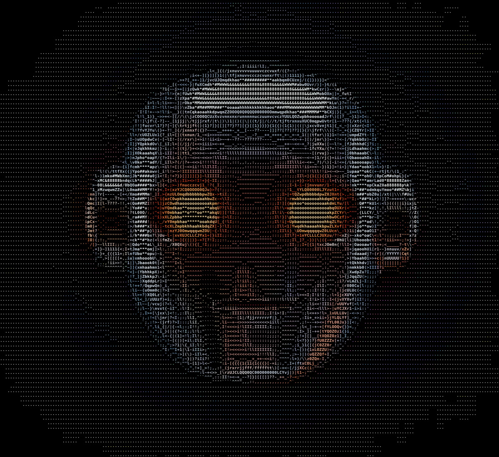
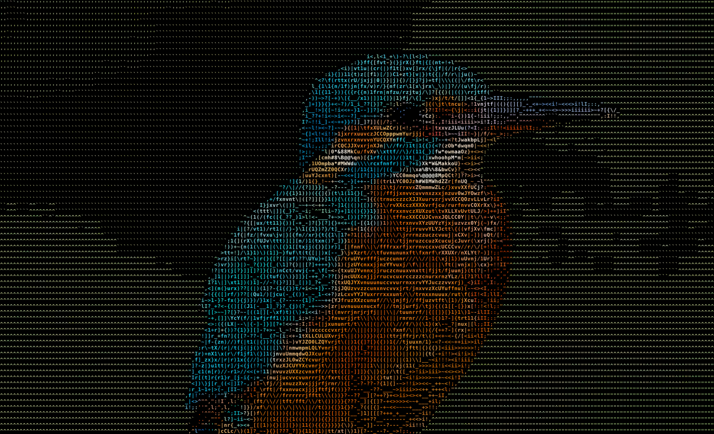
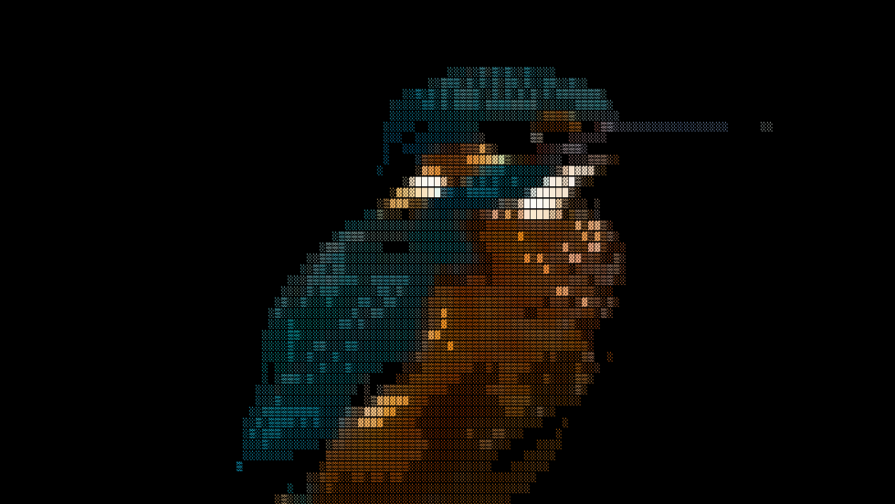

<div align="center">



# ASCII World

**Turn any image into ASCII art — at Rust speed, built for agent workflows.**

[](https://github.com/Liohtml/ASCII-World/actions/workflows/ci.yml)
[](LICENSE)
[](https://www.rust-lang.org/)
[](#-use-it-from-your-agent-mcp)
[](CONTRIBUTING.md)

*A standalone Rust rewrite of the beloved [ASCII-generator](https://github.com/vietnh1009/ASCII-generator) —
one static binary, zero runtime dependencies, ~50× faster, with JSON output and a built-in
[MCP server](#-use-it-from-your-agent-mcp) so your AI agents can make art too.*

</div>

---

## Why ASCII World?

The original Python ASCII-generator is wonderful, but it needs Python + OpenCV + NumPy + Pillow,
and it predates the age of AI agents. ASCII World is a ground-up rewrite designed for 2026 workflows:

| | ASCII World (Rust) | Original (Python) |
|---|---|---|
| Install | one static binary | Python + cv2 + numpy + Pillow |
| `img → txt`, 300 cols | **5 ms** | 253 ms |
| Machine-readable output | ✅ `--json` (lines + per-cell colors) | ❌ |
| Streams via stdin/stdout | ✅ | ❌ |
| MCP server for agents | ✅ built in | ❌ |
| Use as a library | ✅ crate API | ❌ |

<sup>Benchmark: same source image, identical 300×82 output grid, average of 10 runs including process
startup, Intel Core Ultra 5 225U. Reproduce with [`docs/BENCHMARK.md`](docs/BENCHMARK.md).</sup>

## Gallery

Every image below was generated by `ascii-world` — zoom in, it's all characters.

| `--color` | `--charset blocks --color` |
|---|---|
|  |  |

And plain text, straight to your terminal (`ascii-world txt robot.webp --width 88 --invert`):

```text
...........'''`tu>>__!>J#k!;}Ymkooooapt?I:,,,"",:;!{ZhoooohwU\;:v*Z]>-]?_t1''...........
...........'''`cj^```"IxbC::/Cpa***o*kz?l;:::::;I>\boooooodLri")pY>,```")n''............
............''`ut`''.`"f#a>I_v0phooak0{~I:,,,,,:;l]YbaooabZX);lJ*X;"'.'.}r'.............
............'''(x"^""^"f*#c+(]/zL0QYf?>I:,,,"",,:;l+|zQ0QUx}({{aovI,:::^{}..............
..............',(~!i!:!Xo*O-l1\({]_<!;:,,,""""""",:II>+]1|//_ivokt}i]]-/]`..............
```

## Quickstart

```bash
# install (Rust toolchain required — https://rustup.rs)
cargo install --git https://github.com/Liohtml/ASCII-World

# image → ASCII in your terminal
ascii-world txt photo.jpg --width 120

# true-color terminal art
ascii-world txt photo.jpg --ansi

# image → rendered ASCII PNG (like the gallery above)
ascii-world img photo.jpg -o art.png --color

# pipe-friendly: reads stdin, writes stdout
curl -s https://example.com/cat.png | ascii-world txt - --width 80
```

Run `ascii-world charsets` to see every built-in character set (`simple`, `complex`, `blocks`,
8 language alphabets) — or bring your own with `--charset custom:"<chars dark→light>"`.
`ascii-world txt --help` / `img --help` list all flags: width, background, font size, inversion.

## 🤖 Use it from your agent (MCP)

ASCII World ships a built-in [Model Context Protocol](https://modelcontextprotocol.io) server —
no wrapper, no Node, no Python. Any MCP client gets an `image_to_ascii` tool:

```bash
# Claude Code
claude mcp add ascii-world -- ascii-world mcp
```

```json
// Cursor / Windsurf / generic MCP config
{
  "mcpServers": {
    "ascii-world": { "command": "ascii-world", "args": ["mcp"] }
  }
}
```

Your agent can now do things like *"convert build/hero.png to 120-column ASCII and put it in the
CLI's splash screen"* in one tool call.

**No MCP? JSON works everywhere.** `--json` emits the grid, the charset, and per-cell `#rrggbb`
colors — everything a downstream program (or LLM) needs to re-render the art in HTML, SVG, or a TUI:

```bash
ascii-world txt photo.jpg --width 60 --json | jq '{cols, rows, first: .lines[0]}'
```

There's also an [`AGENTS.md`](AGENTS.md) so coding agents can navigate this repo instantly.

## Use it as a library

```rust
use ascii_world::{charset, engine, render};

let ramp = charset::resolve("complex")?;
let img = image::open("photo.jpg")?.to_rgb8();
let grid = engine::convert(&img, &engine::Options {
    width: 100,
    charset: ramp.clone(),
    ..Default::default()
})?;
println!("{}", render::to_text(&grid));
```

## How it works

1. The image is divided into a grid of cells (`--width` columns; cell height = 2× width to match
   terminal glyph proportions).
2. Each cell's average [Rec. 601 luma](https://en.wikipedia.org/wiki/Luma_(video)) picks a character
   from a **density-sorted ramp** — language charsets are sorted at runtime by rasterizing every
   glyph with the embedded DejaVu Sans Mono font and measuring real pixel coverage.
3. Renderers turn the grid into plain text, ANSI true-color, JSON, or a PNG painted glyph-by-glyph
   (with value-normalized cell colors so colored output stays vivid).

## Roadmap

- [ ] `video2video` — feature parity with the original's video modes
- [ ] Animated GIF output
- [ ] Braille charset (`⣿`) for 2×4 sub-cell resolution
- [ ] CJK charset presets (needs a bundled CJK-capable font)
- [ ] Parallel cell sampling (rayon) for gigapixel inputs
- [ ] Auto-crop of empty margins in PNG output (legacy parity)
- [ ] WASM build — ASCII art in the browser

Want one of these? They're tagged as [issues](https://github.com/Liohtml/ASCII-World/issues) —
contributions are very welcome. See [CONTRIBUTING.md](CONTRIBUTING.md).

## Credits & license

MIT. Started as a fork of [vietnh1009/ASCII-generator](https://github.com/vietnh1009/ASCII-generator)
by Viet Nguyen — the character ramps, cell-averaging approach, and glyph-density sorting idea come
from there. The original Python implementation is preserved on the
[`legacy-python`](https://github.com/Liohtml/ASCII-World/tree/legacy-python) branch.
Gallery source images were AI-generated for this project ([Z-Image-Turbo](https://huggingface.co/spaces/mcp-tools/Z-Image-Turbo)).
Embedded font: [DejaVu Sans Mono](assets/fonts/DejaVu-Fonts-License.txt).

<div align="center">
<sub>If ASCII World made your terminal prettier or your agent artsier, a ⭐ helps others find it.</sub>
</div>
